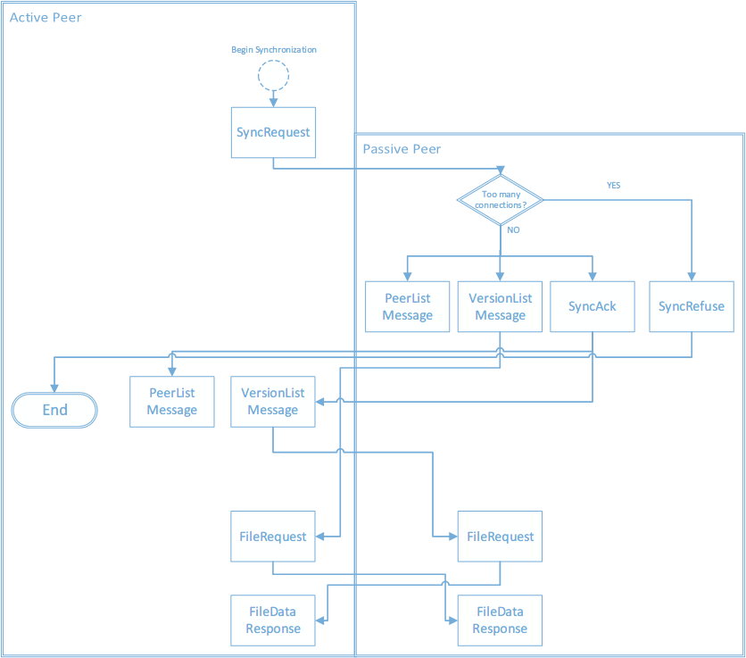
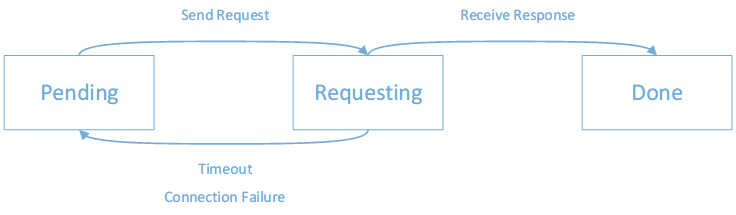
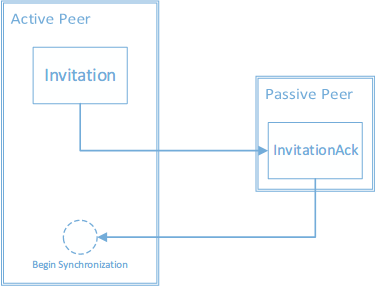

# Distribox: Design Documentation

# Overview
## Architecture

Distribox is designed as a P2P system, which means every peer (or
node, client) in the network is equal. No peer plays a role as a
manager or supervisor. Therefore we have only one kind of client, and
each client can join the synchrounization network by being inviting by
another client.

The client runs on a machine. It monitors a folder on local file
system. With handling the hooks of operating system, it gathers all
file events, and builds a version tree. The synchronization runs in
another thread periodically. On every progress of synchronization, the
client finds a target peer with Anti-entropy algorithm, and generates
a patch containing the difference between the local peer and remote
peer. Then the patch will be sent to the target, and applys to the
remote version tree. At the same time the remote peer sends a patch
back as well. After a synchronization between the two clients, they
will be fully synchrounized up-to-date. Then both the two peers will
propagate changes to other peers on the next synchronization. It is
proved that all peers in the network will eventually consistency.

Since the architecture of Distribox is totally distributed and
decentralized, there is no single point of failure. We perserved all
versions of all files, so no data will lose even if one peer is
controlled by a unauthorized user or invader.

## Modules

To implement the distributed system, we devided the software into
modules below:

* Network
* File System
* Common Library
* Command Line Interface

## Third-party Libraries

* SharpZipLib
* IronRuby
* Newtonsoft.Json
* log4net

# File System Module
## Structure

### File Watcher
Listens to the file system change notifications and raises events when a directory, or file in a directory, changes.

### File Event
There are four kinds of event, created/changed/renamed/deleted.

### Version Control
When file event happened, this class will handle these events and maintain version list.

### Version List
All file whatever exist or deleted, we will record its version.

### File Item
File item is a version of a file.

## Version management

A version includes:

* File ID: a 160-bit random number, generated when a new file is created.
  
* Event ID: a 160-bit random number, generated when a event happened to a file.

* Is Directory: Weather this is a file or directory.

* Timestamp: the time of the commit, in GMT. If this time is incorrect
  or asynchronized among peers. Distribox may respect wrong file as
  the latest. This mistake could be repaired by manually set the
  correct latest version. (We haven't considered how to spread this
  correction to other peers yet.)

* File Event Type: Created or 

* File item: Contains fully information about one single event happened to a file.
  
* File list: List of file items.

## Storage organization

The file system (`.Distribox` folder) can be organized with hierarchies:

* List of versions
* Data of versions
* List of peers

## File system event monitor
### Create
Create a new file id, represent this file.
Add a new version to this file, whose SHA1 checksum is empty, type is `Created`.

### Change
Copy the file into `.Distribox/data/`, name of witch is it's SHA1 checksum.
Add a new version to this file, whose type is `Changed`.

### Delete
Add a new version to this file, whose SHA1 checksum is empty, and type is `Deleted`.

### Rename
Add a new version to this file, name of witch is it's relative path, and type is `Renamed`.

## Design Patern
* Protocol Message Factory: Factory
* Protocol Message: Visitor
* Command Line Interface: Interpreter

# Network Module

## Protocol

There are 2 kind of protocols, Distribox uses a hybrid approach of
both:

Anti-entropy: Each peer picks a random peer periodically and these two
peers synchronize their data completely. This approach is extremely
reliable but changes propagates slowly. Anti-entropy is suitable when
significant difference of peers exists, for example, a newly-invited
peer or a peer which has just login.

Gossip protocol: Rather than synchronizing data completely, gossip
protocol spreads updates (as rumor). When a peer receive a new rumor,
the rumor becomes hot. If a peer sends a rumor to other peers and is
acknowledged that the rumor has already been seen, the rumor will
becomes cold. Rumor cycles can be more frequent than anti-entropy
cycles because they require fewer resources at each site, but there is
some chance that an update will not reach all sites.

These ideas exists since 1987[1], by the propose for replicated
database maintenance in Xerox company. Since Distribox can be
considered as a replicated database, where versions in Distribox are
considered as records in database, we found that the ideas are still
applicable to Distribox without major modifications. The major
difference these two scenarios perhaps are

* Connection speed
* Network stability

Anti-Entropy favors fast connection speed and can deal with network
instability, while gossip protocol favors relatively good network
stability.

### Design philosophy

Distribox's protocol aims to be

* Simple
* Robust

The key to achieve robustness is reduce memory and side-effects. The
complexity of distributed protocol designing arise from inconsistency:
if connection between peer A and peer B closed unexpectedly, how do A
and B know this and ensure their consisteny? If peers don't remember
any "states", there won't be any inconsistency. Our protocol are
designed to be event-driven, states are encoded in events. If any
connection error happens, the event will lost automatically, which is
exactly what we want do to maintain consistency.

### Global Data structure
Anti-Entropy protocol need to maintain these global data structures.

* Peer List

  Stores every known peer's IP and port, whatever if it is online
  currently. This peer list will be synchronzied between all peers.
  
* Version List

  Stores meta data of patches.

* Patch data

  Actual data of patches.

### Synchronization
Every peer periodcally try to start a synchronization with a random
picked peer in its peer list. By starting a synchronization, all the
data structures of the two peers will eventually synchronized.

The synchronization procedure acts as follows:

1. Suppose A want to synchronize with B now, to do so, it sends a
SyncRequest message to B. 

2. Receiving SyncRequest, if number active connections does not exceed
a given limit, B will accept this synchronization by send a SyncAck
message. Otherwise it will do nothing to reject the message.

3. B send its peer list and version list to A.

4. Receiving SyncAck, A send its peer list and version list to B.

5. For each peer receiving peer list, it merge the received list with
its own.

6. For each peer receving version list, it computes the files which
remote peer has but it don't has. It computes patchRequests for these
patches. But it acknowledge these patchRequest to a request manager,
which add them to its own pending list rather than send out all of the
requests now to avoid network congestion.

To fetch actual patch data, a peer periodcally ask its request manager
for pending request. If there are any, request manager will select a
collection of requests, satisfing following condition:

* They can be fetched from one same peer
* The total data of these patches do not exceed 4MB

The peer will send these requests to a peer. After the remote peer
receives these requests, it packs these patches to a zip file and send
back. The requesting peer will store these files locally and update
its version list.

### Request management
The request manager maintain a list of all pending requests. There are
3 stages of a requests lifecycle, forming a state machine:

* Pending
* Requesting
* Done

When a request is send out, it become requesting. If we don't get the
desired response in a time limit, the request will expire and become
pending again. Ths time limit will be adjusted adaptively. If
desired response is get in time limit, the state of the request will
become done, otherwise the response will be discarded. The pending and
requesting list will be lost if a peer is offline. The requests will
be add to request manager again when the peer is receiving version
list from other peers.

The request manager solves lots of problems and enables lots of
features:

* Ensure every part of a patch is received.
* Ensure a request for a certain patch won't be sent redundantly.
* Accelerate transmission of small files by combining them to a single
  request.
* Enable continuing transferring. By the facility of VersionControl
  module, which divide large patches into 4MB blocks, we can achieve
  continuing transferring at a granuity of blocks.
* Enable fetching large file through many peers. This approach is much
  like traditional P2P software like BitTorrent.

### Peer invitation

Suppose peer A would like to invite peer B, and A knows B's IP address
and port. First, A send an Invitation message to B. After receiving
Invitation, to accept the invitation, B add A to its peer list, send
an InvitationAck back to A. After received InvitationAck, A add B to
its own peer list as well and try to synchronize with B immediately by
sending a SyncRequest. See the flow chart below.

### Online and Offline

Nothing should be done when a peer is online and offline in the
protocol module of distribox. When it is online, it just do some
initialization and wait for synchronization. When it is offline,
nothing need to be saved, since we use event-driven architecture to
reduce the need of maintaining to the lowest level.

### Protocol Messages

Currently, Distribox have these kind of messages:

* Invitation
* InvitationAck
* SyncRequest
* SyncAck
* SyncRefuse
* PeerListMEssage
* VersionListMessage
* PatchRequest
* FileDataResponse

# Common Library

## Logger

The logger can record logs at different level

* Debug
* Info
* Warning
* Error
* Fatal

It is implementation by third-party library.

## Configuration

The configuration file is read and stored as a json object. By utilizing json
serialization, we can easily create a powerful yet readable
configuration file. The configuration contains information such as

* Root folder to watch
* Connection period

## Global properties

* String resources
* Default values for configuration file

## Json serialization

We used a third-party library: SharpZipLib.

# Command Line Interface

We use read-eval-print-loop as command line interface.
You can call function declared in class API by using ruby's syntax.

Exampe: `api.Invite(6666)`

# Contributors

* [Carbo Kuo](http://www.byvoid.com/project) (郭家寶)
  * Architect and development coordinator
  * Code reviewer and documentation maintainer
* [Chris Chen](http://ml-thu.net/~jianfei) (陳鍵飛)
  * Designer of Distribox's version of Anti-entropy protocol
  * Developer of network module
* [Wenjie Song](http://curimit.com/blog) (宋文杰)
  * Developer of file system module
  * C# language specialist

# Reference

[1] Demers, Alan, et al. "Epidemic algorithms for replicated database
maintenance."Proceedings of the sixth annual ACM Symposium on
Principles of distributed computing. ACM, 1987.
