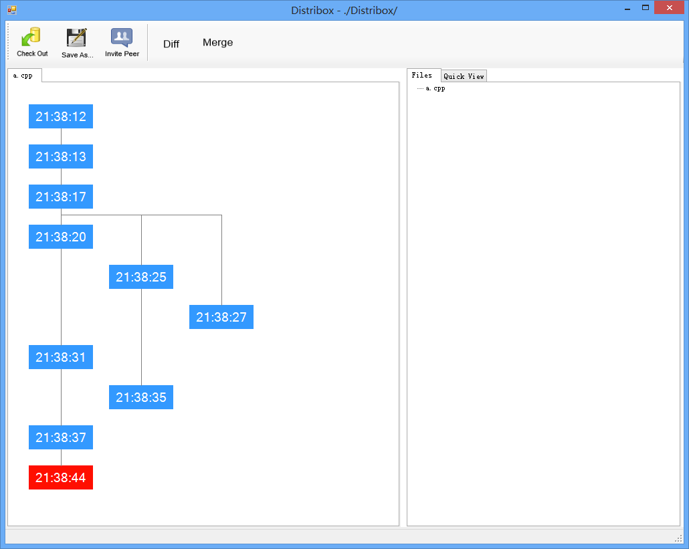

# Distribox: User Manual

# Introduction 

Distribox is a file synchronization tool based on p2p
algorithms. Clients can join a P2P network to share files on local
file system automatically like Dropbox or Google Drive. By using
Distribox, you can push your documents, photos or anything else in to
a folder, and Distribox will synchronize them with the cloud. If you
have multiple devices (laptop, phone, pad), Distribox enables you to
synchronize files between them. They can also share folders with other
users by specifying collaborators or making the folder public.

Distribox is born with sharing, because it copies all the files to all
the other nodes in the P2P network. Imagine such a scene: a small
group of people in a local area network that need to exchange files
frequently. As long as one person adds, edits, or removes a file, all
the other people can see the modification instantly on their local
computers.

# Getting Started

## Installation

Unzip the package you downloaded. You should get a folder `Distribox`
with one files `Distribox.CLI.exe`, copy the folder to a place you
wish to install Distribox. Run `Distribox.CLI.exe` and then close it,
it will generate `config.json`

## Configation

You should config Distribox before you can use it. Open `config.json`
with a text editor.

    notepad config.json

The content should looks like this

    {
      "ListenPort": 6666,
      "RootFolder": "c:/your_path",
      "ConnectPeriodMs": 1000,
      "FileWatcherTimeIntervalMs": 1000
    }

Change `your_path` to the root folder you want Distribox to monitor,
save the file and close. 

## Invitation

Run `Distribox-CLI.exe`, you should see a interactive command line
interface

    Ruby>
    
It displays `Ruby>` because we use Ruby as our command line interface
environment, you can enter typical Ruby commands here.

To invite your first peer, enter 

    Ruby> api.invite(1234)
    
you can replace `1234` with the listening port of who you want to
invite.

## GUI

Run `Distribox.GUI.exe`, you will see a window like this:

All files in distribox will show at right in "Files" tab.
You can view a file by select it in the folder tree.
Once you select a file at right, the graph will display the whole version tree at left.

You can drag/zoom the graph as you can.The nodes are ordered by time.

Distribox store all the versions of a file.

#### Features
1. Double click a node will open the history version of this file.
2. Select a node and click "Check Out" can recover to that version.
3. Select a node and click "Save As" can save this version to other places.
4. Choose "Quick View" at right, when you select a node at left, you can see the preview of the selected version in "Quick View" window.

If you installed kdiff3, it provide some advanced feature:

+ Select a node and click "Diff" will show the difference between selected version and current version.
+ Select a node and click "Merge" can merge the selected version and current version.

## Synchronization

Try to create a file in `your_path`, it should appear in another
peer's folder.

# FAQ
